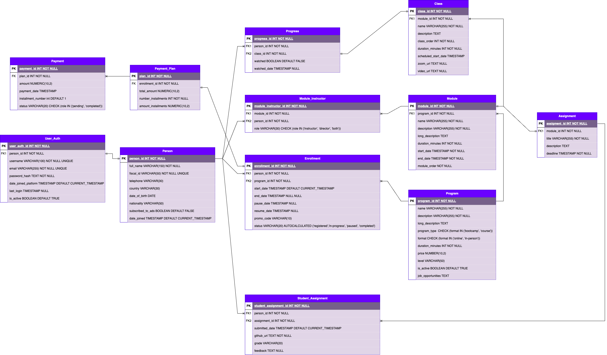

# Diagrama Entidad Relación de KeepCoding

## Objetivo
Realizar el diagrama entidad relación con el que poder modelar una base de datos para Keepcoding, es decir, recogiendo datos de alumnos, bootcamps, módulos, profesores, etc.

## Introducción

El Modelo Entidad-Relación adjuntado en la página anterior, representa una manera de diseñar y estructurar la base de datos de la plataforma KeepCoding. En este modelo se gestionan estudiantes, instructores, programas de formación, módulos, pagos y el progreso de los estudiantes y la intención es hacerlo de manera eficiente, garantizando la integridad referencial y posible escalabilidad.

## Entidades
El modelo se compone de varias entidades, y algunas de ellas interconectadas entre sí.

- **Person**: Representa individuos del sistema, en este caso estudiantes e instructores, pero podría extenderse para almacenar otro tipo de personas.

- **User_Auth**: Gestiona la autenticación de los usuarios en la plataforma, asegurando un inicio de sesión seguro y la gestión del estado de la cuenta.

- **Program**: Contiene información sobre bootcamps / cursos.

- **Module**: Contiene toda la información de los módulos que pertenecen a un programa.

- **Class**: Contiene la información para el acceso a una clase de un módulo específico en determinado día.

- **Module_Instructor**: Relación que define los módulos en los cuales los instructores imparten clases y el rol que ese instructor tiene.

- **Assignment**: Define proyectos y tareas dentro de un módulo.

- **Enrollment**: Registra la relación entre estudiantes y programas.

- **Progress**: Almacena el avance de un estudiante en sus clases.

- **Student_Assignment**: Relación que almacena las entregas de prácticas de un estudiante y su nota.

- **Payment_Plan**: Gestiona los pagos y financiamiento de los cursos.

- **Payment**: Gestiona los pagos realizados, ya sean pagos únicos o pagos de financiamiento.

### Person
En lugar de tener entidades separadas para cada tipo de persona, esta entidad representa a cualquier individuo, asegurando un diseño flexible y escalable.  Podría extenderse y usarlo para almacenar otro tipo de personas a parte de estudiantes e instructores.  Además contiene información personal y de contacto relevante.

#### 📌 Atributos
| **Nombre del Campo**   | **Tipo de Campo**       | **Descripción** |
|------------------------|------------------------|----------------|
| **person_id**        | 🔑 Clave Primaria (PK) | Identificador único de la persona. |
| **full_name**        | Atributo Simple    | Nombre completo de la persona. |
| **fiscal_id**        | Atributo Simple, Único | Número de identificación fiscal. |
| **telephone**        | Atributo Simple    | Número de teléfono de contacto. |
| **country**          | Atributo Simple    | País de residencia. |
| **date_of_birth**    | Atributo Simple    | Fecha de nacimiento. |
| **nationality**      | Atributo Simple    | Nacionalidad. |
| **subscribed_to_ads** | tributo Simple, Booleano | Indica si la persona acepta recibir publicidad (`TRUE` / `FALSE`). |
| **date_joined**      | Atributo Derivado (Timestamp) | Fecha en la que la persona se registró en la plataforma. |

### User_Auth
Esta entidad estiona la autenticación de los usuarios en la plataforma, asegurando un inicio de sesión seguro y la gestión del estado de la cuenta.
Tiene relación 1:1 con la entidad Person, lo cual significa que cada usuario autenticado está vinculado a una única persona en la plataforma. 

#### 📌 Atributos
| **Nombre del Campo**   | **Tipo de Campo**       | **Descripción** |
|------------------------|------------------------|----------------|
| **user_auth_id**     | 🔑 Clave Primaria (PK) | Identificador único para la autenticación del usuario. |
| **person_id**        | 🔗 Clave Foránea (FK)  | Relación con `Person`, vinculando la cuenta con una persona. |
| **username**         | Atributo Único      | Nombre de usuario único para autenticación. |
| **email**            | Atributo Único      | Correo electrónico único asociado a la cuenta. |
| **password_hash**    | 🔐 Atributo Seguro     | Hash de la contraseña para almacenamiento seguro. |
| **date_joined_platform** | Atributo de Registro | Fecha en la que el usuario creó su cuenta. |
| **last_login**       | Atributo de Sesión  | Última vez que el usuario inició sesión en la plataforma. |
| **is_active**        | Estado de Cuenta    | Indica si la cuenta está activa (`TRUE`/`FALSE`). |

### Program
Esta entidad representa los diferentes **bootcamps** y **cursos** ofrecidos en la plataforma. Contiene información clave sobre cada programa, incluyendo su formato, duración, costo y oportunidades laborales.

#### 📌 Atributos
| **Nombre del Campo**   | **Tipo de Campo**       | **Descripción** |
|------------------------|------------------------|----------------|
| **program_id**       | 🔑 Clave Primaria (PK) | Identificador único del programa. |
| **name**             | Atributo Simple    | Nombre del programa (Bootcamp o Curso). |
| **description**      | Atributo Simple    | Descripción corta del programa. |
| **long_description** | Atributo Texto     | Descripción detallada del contenido del programa. |
| **program_type**     | Atributo de Clasificación | Define si es un `bootcamp` o un `course`. |
| **format**           | Atributo de Modalidad | Indica si es `online` o `in-person`. |
| **duration_minutes** | Atributo de Duración | Duración total en minutos del programa. |
| **price**            | Atributo Numérico   | Costo total del programa. |
| **level**            | Atributo de Nivel   | Nivel de dificultad del programa (ej. `beginner`, `advanced`). |
| **is_active**        | Estado del Programa | Indica si el programa está activo (`TRUE` / `FALSE`). |
| **job_opportunities** | Atributo de Salida Laboral | Información sobre oportunidades laborales al completar el programa. |

### Module
Esta entidad representa los módulos de aprendizaje dentro de un **programa** (bootcamp o curso). Cada módulo contiene información sobre su contenido, duración y fechas clave.
La relación con la entidad `Program` es N:1, es decir cada módulo pertenece a un único programa, y un programa puede tener muchos módulos.  

#### 📌 Atributos
| **Nombre del Campo**   | **Tipo de Campo**       | **Descripción** |
|------------------------|------------------------|----------------|
| **module_id**       | 🔑 Clave Primaria (PK) | Identificador único del módulo. |
| **program_id**      | 🔗 Clave Foránea (FK)  | Relación con `Program`, indicando a qué programa pertenece el módulo. |
| **name**            | Atributo Simple    | Nombre del módulo. |
| **description**     | Atributo Simple    | Breve descripción del módulo. |
| **long_description** | Atributo Texto    | Descripción detallada del contenido del módulo. |
| **duration_minutes** | Atributo de Duración | Duración total del módulo en minutos. |
| **start_date**      | Atributo de Fecha   | Fecha de inicio del módulo. |
| **end_date**        | Atributo de Fecha   | Fecha de finalización del módulo. |
| **module_order**    | Atributo de Orden   | Define el orden en el que el módulo debe ser tomado dentro del programa. |

### Class

Esta entidad representa las clases individuales dentro de un módulo de un programa. Cada clase tiene una fecha programada, un enlace de Zoom para sesiones en vivo y un enlace de video para revisiones posteriores. Esta clase se relaciona con `Module` de manera N:1, dado que cada clase pertenece a un único módulo, y un módulo puede tener muchas clases.

#### 📌 Atributos
| **Nombre del Campo**   | **Tipo de Campo**       | **Descripción** |
|------------------------|------------------------|----------------|
| **class_id**         | 🔑 Clave Primaria (PK) | Identificador único de la clase. |
| **module_id**        | 🔗 Clave Foránea (FK)  | Relación con `Module`, indicando a qué módulo pertenece la clase. |
| **name**             | Atributo Simple    | Nombre de la clase. |
| **description**      | Atributo Texto     | Descripción del contenido de la clase. |
| **class_order**      | Atributo de Orden   | Define el orden en el que la clase debe ser tomaza dentro del módulo. |
| **duration_minutes** | Atributo de Duración | Duración total de la clase en minutos. |
| **scheduled_start_date** | Atributo de Fecha | Fecha y hora programada en la que se impartirá la clase. |
| **zoom_url**         | Atributo de Enlace  | URL para acceder a la sesión en vivo por Zoom (si aplica). |
| **video_url**        | Atributo de Revisión | URL del video de la clase para acceso posterior. |

### Module_Instructor
Esta entidad representa la relación entre los **módulos de un programa** y los **instructores asignados**. Permite identificar qué profesores imparten cada módulo y su rol dentro de la enseñanza, pudiendo ser `instructor` , `director` o `ambos`.

Las relaciones con `Module` y `Person` son N:1, lo cual significa que cada instancia de Module_Instructor puede ser impartida solo por un instructor en un módulo.
A lo largo del tiempo los instructores pueden impartir varias veces el mismo módulo en diferentes fechas, ya que un módulo tiene un identificador diferente y éste puede cambiar a lo largo de los diferentes bootcamps o cursos.

#### 📌 Atributos
| **Nombre del Campo**   | **Tipo de Campo**       | **Descripción** |
|------------------------|------------------------|----------------|
| **module_instructor_id** | 🔑 Clave Primaria (PK) | Identificador único de la relación entre módulo e instructor. |
| **module_id**        | 🔗 Clave Foránea (FK)  | Relación con `Module`, indicando el módulo que imparte el instructor. |
| **person_id**        | 🔗 Clave Foránea (FK)  | Relación con `Person`, identificando al instructor asignado. |
| **role**             | Atributo de Rol     | Indica el rol del instructor en el módulo: `instructor`, `director` o `both`. |

### Assignment
Esta entidad sirve para representar las prácticas o proyectos en las que los estudiantes serán evaluados y que deben entregarse al finalizar un **módulo**.

Un asigment tiene una relación 1:1 con la entidad `Modules`. Cada módulo solo tiene un assignment y un assignment pertenece solo a un módulo.

#### 📌 Atributos
| **Nombre del Campo**   | **Tipo de Campo**       | **Descripción** |
|------------------------|------------------------|----------------|
| **assignment_id**    | 🔑 Clave Primaria (PK) | Identificador único de la asignación. |
| **module_id**        | 🔗 Clave Foránea (FK)  | Relación con `Module`, indicando a qué módulo pertenece la asignación. |
| **title**            | Atributo Simple    | Título de la asignación. |
| **description**      | Atributo Texto     | Descripción detallada de la tarea o proyecto. |
| **deadline**         | Atributo de Fecha   | Fecha y hora límite para la entrega de la asignación. |

### Enrollment
Esta entidad representa la inscripción de una **persona en un programa** (curso o bootcamp). Es crucial para rastrear qué programas han sido tomados por cada estudiante y en qué estado se encuentra su inscripción. Es fundamental para gestionar el registro, estado y progreso de los estudiantes en la plataforma, permite saber cuando un estudiante se apuntó a un programa, el estado del mismo, si lo ha pasado y si ha disfrutado de promoción.

Las relaciones con `Person` y `Program` son N:1, cara registro pertenece a una persona en un programa, pero un estudiante puede estar inscrito en varios programas y su vez un programa puede tener múltiples inscripciones activas.
 
#### 📌 Atributos
| **Nombre del Campo**   | **Tipo de Campo**       | **Descripción** |
|------------------------|------------------------|----------------|
| **enrollment_id**    | 🔑 Clave Primaria (PK) | Identificador único de la inscripción. |
| **person_id**        | 🔗 Clave Foránea (FK)  | Relación con `Person`, indicando el estudiante inscrito. |
| **program_id**       | 🔗 Clave Foránea (FK)  | Relación con `Program`, indicando el curso o bootcamp en el que se inscribió. |
| **start_date**       | Atributo de Fecha   | Fecha en la que el estudiante se inscribió (por defecto, la fecha actual). |
| **end_date**         | Atributo de Fecha   | Fecha en la que finalizó el programa (si aplica). |
| **pause_date**       | Atributo de Pausa  | Fecha en la que el estudiante pausó su inscripción. |
| **resume_date**      | Atributo de Reanudación | Fecha en la que el estudiante reanudó sus estudios. |
| **promo_code**       | Atributo Promocional | Código de descuento aplicado en la inscripción (si aplica). |
| **status**           | Atributo de Estado  | Estado actual de la inscripción (`registered`, `in-progress`, `paused`, `completed`). |

### Progress
Esta entidad es clave para medir el avance de los estudiantes en un programa de aprendizaje, permitiendo saber qué clases han sido vistas y cuándo.  Permite rastrear el progreso de un **estudiante en cada clase** de un módulo dentro de un programa.

Las relaciones con `Person` es N:1, porque un estudiante puede tener muchos progresos, y cada progreso pertenece solo a una persona. La relación con `Class` es 1:1 porque cada progreo es de una clase.

#### 📌 Atributos
| **Nombre del Campo**   | **Tipo de Campo**       | **Descripción** |
|------------------------|------------------------|----------------|
| **progress_id**      | 🔑 Clave Primaria (PK) | Identificador único del progreso. |
| **person_id**        | 🔗 Clave Foránea (FK)  | Relación con `Person`, indicando el estudiante que visualizó la clase. |
| **class_id**         | 🔗 Clave Foránea (FK)  | Relación con `Class`, indicando la clase vista por el estudiante. |
| **watched**          | Estado de Visualización | Indica si el estudiante ha visto la clase (`TRUE` / `FALSE`). |
| **watched_date**     | Atributo de Fecha   | Fecha y hora en la que el estudiante completó la clase. |

### Student_Assignment
Esta entidad almacena la relación entre los **estudiantes y las asignaciones** dentro de un módulo. Es clave para el seguimiento y evaluación del rendimiento de los estudiantes en los módulos de aprendizaje. Permite rastrear la entrega de tareas, su calificación y los comentarios del instructor.

Las relaciones con `Person` y `Assignment` son N:1 dado que cada seguimiento pertenece a una persona dado un assignment, y a su vez una persona puede tener muchos assigments para cada módulo entregados.

#### 📌 Atributos
| **Nombre del Campo**        | **Tipo de Campo**       | **Descripción** |
|----------------------------|------------------------|----------------|
| **student_assignment_id** | 🔑 Clave Primaria (PK) | Identificador único de la entrega de una asignación. |
| **person_id**            | 🔗 Clave Foránea (FK)  | Relación con `Person`, identificando al estudiante que entrega la asignación. |
| **assignment_id**        | 🔗 Clave Foránea (FK)  | Relación con `Assignment`, indicando la asignación entregada. |
| **submitted_date**       | Atributo de Fecha   | Fecha y hora en la que el estudiante realizó la entrega. |
| **github_url**           | Atributo de Enlace  | URL del repositorio de GitHub donde se encuentra la entrega. |
| **grade**                | Atributo de Calificación | Calificación obtenida en la asignación. |
| **feedback**             | Atributo de Retroalimentación | Comentarios o feedback del instructor sobre la entrega. |

### Payment_Plan
Esta entidad permite estructurar opciones de financiamiento para los estudiantes, facilitando el pago en cuotas o en un solo pago.  Almacena los planes de pago de los estudiantes inscritos en un programa. Permite gestionar pagos en una sola cuota o en varias mensualidades.

Se relaciona con `enrollment` 1:1 dado que un `Payment_Plan` se acuerda para un determinado bootcamp o curso que esta cursando una persona y una inscripción puede tener un plan de pago asociado. 

#### 📌 Atributos
| **Nombre del Campo**         | **Tipo de Campo**       | **Descripción** |
|-----------------------------|------------------------|----------------|
| **plan_id**               | 🔑 Clave Primaria (PK) | Identificador único del plan de pago. |
| **enrollment_id**         | 🔗 Clave Foránea (FK)  | Relación con `Enrollment`, indicando la inscripción asociada. |
| **total_amount**          | Atributo Monetario  | Monto total a pagar por la inscripción. |
| **number_installments**   | Atributo Numérico   | Cantidad de pagos en los que se dividirá el monto total. |
| **amount_installments**   | Atributo Monetario  | Monto de cada cuota en el plan de pagos. |

### Payment
Esta entidad permite gestionar y rastrear los pagos de los estudiantes en la plataforma, asegurando un control preciso de las transacciones y su estado. Almacena los pagos realizados por los estudiantes para un plan de financiamiento o pago único de un programa.

Se relaciona con `Payment_Plan` N:1 con dado que un plan de pago puede tener múltiples pagos asociados, pero cada pago pertenece a un unico plan acordado.  

#### 📌 Atributos
| **Nombre del Campo**       | **Tipo de Campo**       | **Descripción** |
|---------------------------|------------------------|----------------|
| **payment_id**          | 🔑 Clave Primaria (PK) | Identificador único del pago realizado. |
| **plan_id**             | 🔗 Clave Foránea (FK)  | Relación con `Payment_Plan`, indicando el plan de pago asociado. |
| **amount**              | Atributo Monetario  | Monto pagado en esta transacción. |
| **payment_date**        | Atributo de Fecha   | Fecha y hora en la que se realizó el pago. |
| **installment_number**  | Atributo Numérico   | Número de cuota dentro del plan de pagos (por defecto, 1 si es un solo pago). |
| **status**              | Atributo de Estado  | Estado del pago: `pending` o `completed`. |

## Conclusión
🚀 Este Modelo Entidad-Relación proporciona una base sólida y escalable para gestionar la información educativa de KeepCoding. Gracias a su diseño modular y relacional, permite una gestión eficiente de estudiantes, programas, pagos y seguimiento de progres entre otros. 🎯  